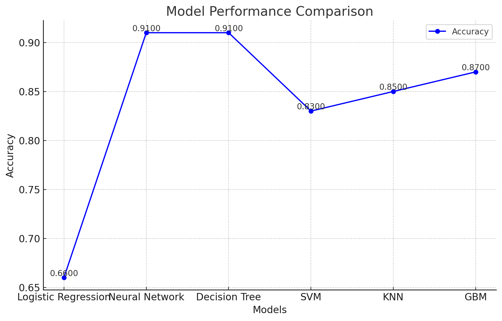
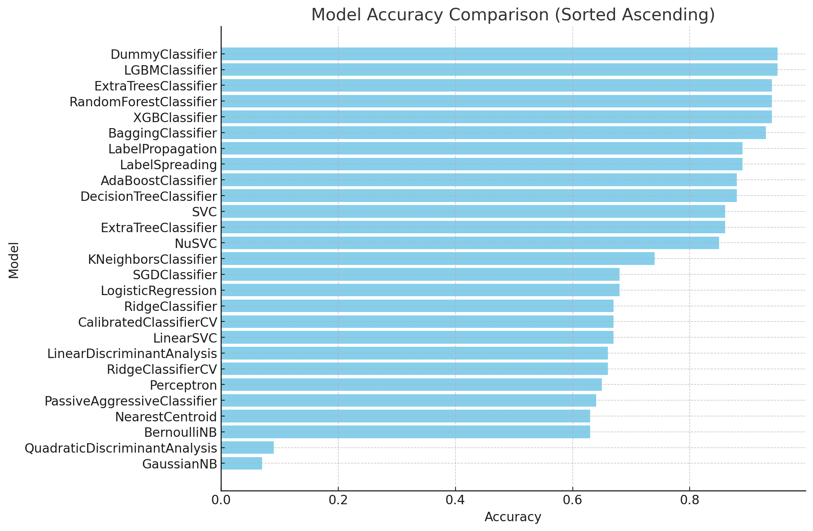
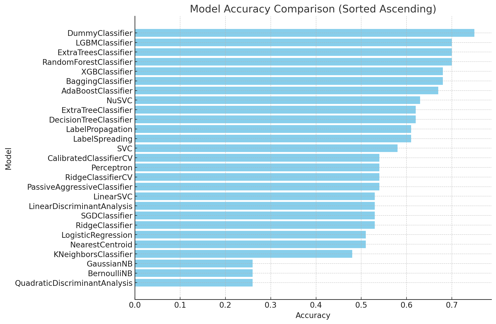

# *Salmonella* and *Campylobacter* in raw chicken carcass
# Sample Analysis
## Overview
This dataset contains raw chicken carcass sampling data from various poultry establishments across the United States. The data are analyzed for the presence of *Salmonella* and *Campylobacter*, critical for monitoring food safety standards. Additionally, the dataset includes detailed weather data corresponding to the collection dates, providing insights into environmental factors that may influence bacterial detection results.


## Data Source
This dataset is provided by the USDA's Food Safety and Inspection Service (FSIS). All data have been collected under strict quality control and assurance procedures to ensure their accuracy and reliability.

## Usage
This dataset is intended for researchers and professionals in food safety, public health monitoring, and environmental science. It allows for the analysis of bacterial contamination in raw chicken and understanding how various environmental factors might impact such results.

# Sample Analysis
## Overview
This Python script facilitates the running of various machine learning models on a specified dataset. It supports logistic regression, MLP classifiers, decision trees, SVM, K-Nearest Neighbors, and Gradient Boosting Machines. Features include handling imbalanced datasets using techniques like Random Over Sampler and SMOTE, configurable model parameters through command-line arguments, and the display of feature importance for applicable models.


## Features
- **Multiple Machine Learning Models:** Choose from several models to train on your data.
- **Configurable Parameters:** Customize model parameters directly via command-line.
- **Feature Importance Display:** For models that support it, display the importance of each feature in the model.
- **Data Preprocessing:** Includes standard scaling and handling missing values.
- **Imbalance Handling:** Options to apply oversampling techniques to balance dataset classes.

## Installation
### Dependencies
To use this script, you'll need Python 3.x and several libraries installed on your system:
- **Pandas**
- **Scikit-learn**
- **Imbalanced-learn**

You can install the necessary Python libraries using pip:
```bash
pip install pandas scikit-learn imbalanced-learn
```
To get started with this project, follow these steps:

```bash
git clone[ https://github.com/FoodDatasets/Predicting-Salmonella-presence-in-raw-chicken-carcass.git
cd Predicting-Salmonella-presence-in-raw-chicken-carcass
```
## Supported Algorithms
-  Logistic Regression
-  Neural Network
-  Decision Tree
-  SVM
-  KNN
-  GBM
## Machine Learning Model Execution Guide
This script allows users to select different machine learning algorithms via command line parameters to train models and evaluate them on a specified dataset.
### Required Arguments
- ` --filepath`: Mandatory. The path to the dataset file.
- ` --model`: Optional. Choose the machine learning model. Default is 'logistic_regression'.
- ` --target`: Optional. Specify the target variable column. Default is 'target'.
### Optional Arguments
- ` --resampling`: Optional. Whether to apply RandomOverSampler for class balancing.
- ` --lr_C`: Optional. Regularization strength for logistic regression (inverse of lambda). Default is 1.0.
- ` --lr_max_iter`: Optional. Maximum iterations for logistic regression. Default is 100.
- ` --mlp_max_iter`: Optional. Maximum iterations for MLP classifier. Default is 200.
- ` --mlp_hidden_layers`: Optional. Number of neurons in the hidden layers for MLP Classifier.
- ` --dt_max_depth`: Optional. Maximum depth for the decision tree. Use 'None' for no limit. Default is 'None'.
- ` --svm_C`: Optional. Regularization parameter for SVM. Default is 1.0.
- ` --svm_kernel`: Optional. Kernel type for SVM. Default is 'rbf'.
- ` --knn_n_neighbors`: Optional. Number of neighbors for KNN. Default is 5.
- ` --gbm_n_estimators`: Optional. Number of boosting stages for GBM. Default is 100.
- ` --gbm_learning_rate`: Optional. Learning rate for GBM.
### Usage Example
Run the script from the command line, specifying the path to your dataset along with options to configure the model:
```bash
python ML_runner.py <path_to_dataset> --model <model_name> --target <target_column> [other options]
```
## Model Performance Results with Resampling Process

The following visualization and tables summarize the performance of different machine learning models after applying resampling.

### Performance Comparison Chart



### Performance Table

| Algorithm        | Accuracy | Precision | Recall (Positive) |  F1-Score (Positive) |
|------------------|----------|----------------------|----------------------|-------------------|
| **Logistic Regression** | 0.66     | 0.07                 | 0.51              | 0.12                |
| **Neural Network**      | 0.91     | 0.13                 | 0.16              | 0.14                |
| **Decision Tree**       | 0.91     | 0.12                 | 0.16              | 0.13                |
| **SVM**                 | 0.83     | 0.07                 | 0.24              | 0.11                |
| **KNN**                 | 0.85     | 0.05                 | 0.13              | 0.08                |
| **GBM**                 | 0.87     | 0.14                 | 0.33              | 0.19                |


## Confusion Matrices

### Logistic Regression Confusion Matrix

|                 | Predicted Negative | Predicted Positive |
|-----------------|---------------------|---------------------|
| **Actual Negative** | 628                   | 305                   |
| **Actual Positive** | 17                   | 28                   |

### Neural Network Confusion Matrix

|                 | Predicted Negative | Predicted Positive |
|-----------------|---------------------|---------------------|
| **Actual Negative** | 896                   | 37                   |
| **Actual Positive** | 40                   | 5                   |

### Decision Tree Confusion Matrix

|                 | Predicted Negative | Predicted Positive |
|-----------------|---------------------|---------------------|
| **Actual Negative** | 873                   | 60                   |
| **Actual Positive** | 41                   | 4                   |

### SVM Confusion Matrix

|                 | Predicted Negative | Predicted Positive |
|-----------------|---------------------|---------------------|
| **Actual Negative** | 799                   | 134                   |
| **Actual Positive** | 32                   | 13                   |

### KNN Confusion Matrix

|                 | Predicted Negative | Predicted Positive |
|-----------------|---------------------|---------------------|
| **Actual Negative** | 819                   | 114                   |
| **Actual Positive** | 37                   | 8                   |

### GBM Confusion Matrix

|                 | Predicted Negative | Predicted Positive |
|-----------------|---------------------|---------------------|
| **Actual Negative** | 843                   | 90                   |
| **Actual Positive** | 30                   | 15                   |


---------------------------------------------------------------------------------------------------------------------------------------------------------------------------------------------------------------------

# LazyPredict Method
## Dependencies

- Python 3.7+
- pandas
- scikit-learn
- imbalanced-learn
- LazyPredict

``` bash
pip install pandas scikit-learn imbalanced-learn lazypredict
```
## Usage
1. Prepare your dataset file
2. Run the script with the dataset file and target column:
### Command-line Arguments
- `--file_path`: Path to the CSV file containing the dataset (required).
- `--target_label`:SalmonellaSPAnalysis or CampylobacterAnalysis30ml
```bash
python LazyChicken.py /path/to/Dataset_RawChickenCarcasses.xlsx --target SalmonellaSPAnalysis( CampylobacterAnalysis30ml)
```

3. The script will output the number of positive cases for the target variable and evaluate various machine learning models.

## Example Output

### SalmonellaSPAnalysis
#### Model Performance Table

| Model                          | Accuracy | Balanced Accuracy | ROC AUC | F1 Score | Time Taken | Sensitivity | Specificity |
|--------------------------------|----------|-------------------|---------|----------|------------|-------------|-------------|
| LGBMClassifier                 | 0.95     | 0.55              | 0.55    | 0.94     | 0.21       | 0.11        | 0.99        |
| DummyClassifier                | 0.95     | 0.50              | 0.50    | 0.93     | 0.03       | 0.00        | 1.00        |
| ExtraTreesClassifier           | 0.94     | 0.52              | 0.52    | 0.93     | 0.86       | 0.04        | 0.99        |
| XGBClassifier                  | 0.94     | 0.56              | 0.56    | 0.93     | 0.33       | 0.13        | 0.98        |
| RandomForestClassifier         | 0.94     | 0.53              | 0.53    | 0.93     | 3.04       | 0.07        | 0.98        |
| BaggingClassifier              | 0.93     | 0.52              | 0.52    | 0.92     | 1.50       | 0.07        | 0.97        |
| LabelSpreading                 | 0.89     | 0.53              | 0.53    | 0.91     | 3.35       | 0.13        | 0.93        |
| LabelPropagation               | 0.89     | 0.53              | 0.53    | 0.91     | 2.94       | 0.13        | 0.93        |
| AdaBoostClassifier             | 0.88     | 0.65              | 0.65    | 0.90     | 1.53       | 0.40        | 0.90        |
| DecisionTreeClassifier         | 0.88     | 0.51              | 0.51    | 0.90     | 0.33       | 0.09        | 0.92        |
| ExtraTreeClassifier            | 0.86     | 0.55              | 0.55    | 0.89     | 0.04       | 0.20        | 0.89        |
| SVC                            | 0.86     | 0.56              | 0.56    | 0.89     | 1.87       | 0.22        | 0.89        |
| NuSVC                          | 0.85     | 0.57              | 0.57    | 0.88     | 2.70       | 0.27        | 0.88        |
| KNeighborsClassifier           | 0.74     | 0.57              | 0.57    | 0.81     | 0.05       | 0.38        | 0.76        |
| LogisticRegression             | 0.68     | 0.62              | 0.62    | 0.77     | 0.12       | 0.56        | 0.68        |
| CalibratedClassifierCV         | 0.67     | 0.62              | 0.62    | 0.77     | 6.89       | 0.56        | 0.68        |
| LinearSVC                      | 0.67     | 0.62              | 0.62    | 0.77     | 1.46       | 0.56        | 0.68        |
| RidgeClassifier                | 0.67     | 0.62              | 0.62    | 0.77     | 0.04       | 0.56        | 0.68        |
| RidgeClassifierCV              | 0.66     | 0.61              | 0.61    | 0.76     | 0.10       | 0.56        | 0.67        |
| LinearDiscriminantAnalysis     | 0.66     | 0.61              | 0.61    | 0.76     | 0.10       | 0.56        | 0.67        |
| Perceptron                     | 0.65     | 0.62              | 0.62    | 0.75     | 0.05       | 0.58        | 0.66        |
| PassiveAggressiveClassifier    | 0.64     | 0.57              | 0.57    | 0.74     | 0.07       | 0.49        | 0.65        |
| BernoulliNB                    | 0.63     | 0.57              | 0.57    | 0.73     | 0.03       | 0.51        | 0.63        |
| NearestCentroid                | 0.63     | 0.54              | 0.54    | 0.73     | 0.05       | 0.44        | 0.64        |
| SGDClassifier                  | 0.68     | 0.63              | 0.63    | 0.77     | 0.17       | 0.58        | 0.68        |
| QuadraticDiscriminantAnalysis  | 0.09     | 0.51              | 0.51    | 0.09     | 0.16       | 0.98        | 0.05        |
| GaussianNB                     | 0.07     | 0.50              | 0.50    | 0.06     | 0.04       | 0.98        | 0.03        |

#### Model Accuracy Comparison



#### Model Comparison


### CampylobacterAnalysis30ml
#### Model Performance Table


#### Model Accuracy Comparison



#### Model Comparison


